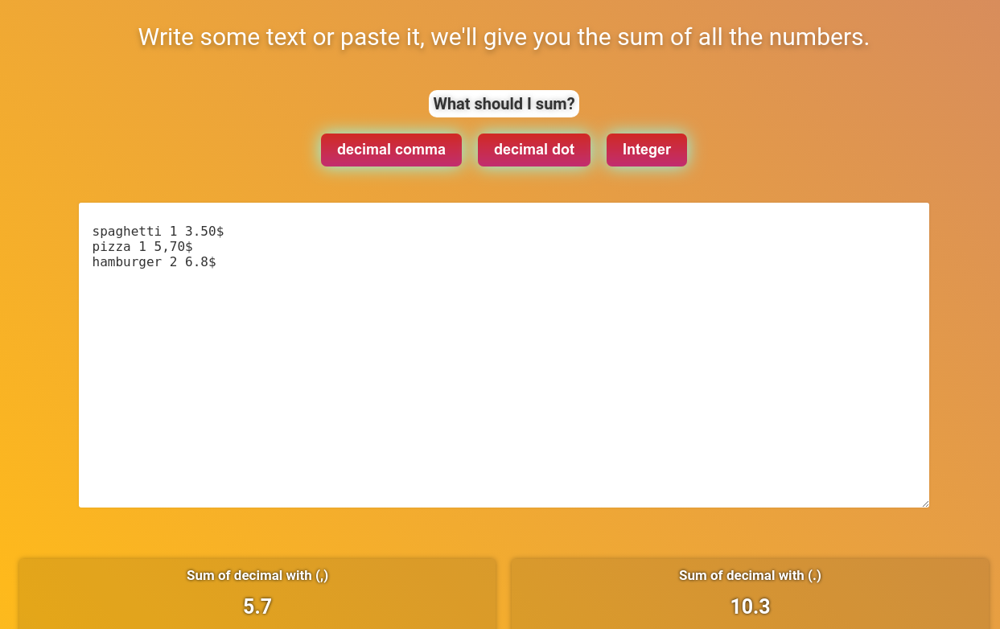

# Magicsum

This project is the source code of the site:

[magicsum.spinanico.com](https://magicsum.spinanico.com)

The application has a very simple operation, it takes care of passing the text to the functions to which you apply regular expressions to search for numbers with comma, period or simple integers.

#### What was used?

the magicsum application was created with react and css3

 <form action="https://www.paypal.com/cgi-bin/webscr" method="post" target="_top">

​                    <input type="hidden" name="cmd" value="_s-xclick" />

​                    <input type="hidden" name="hosted_button_id" value="LKJHNLC76XFNE" />

​                    <input class="mybutton" type="image" value="donate" src="https://www.paypalobjects.com/en_US/i/btn/btn_donate_SM.gif" border="0" name="submit" title="PayPal - The safer, easier way to pay online!" alt="Donate with PayPal button" />

​                    

​                </form>

